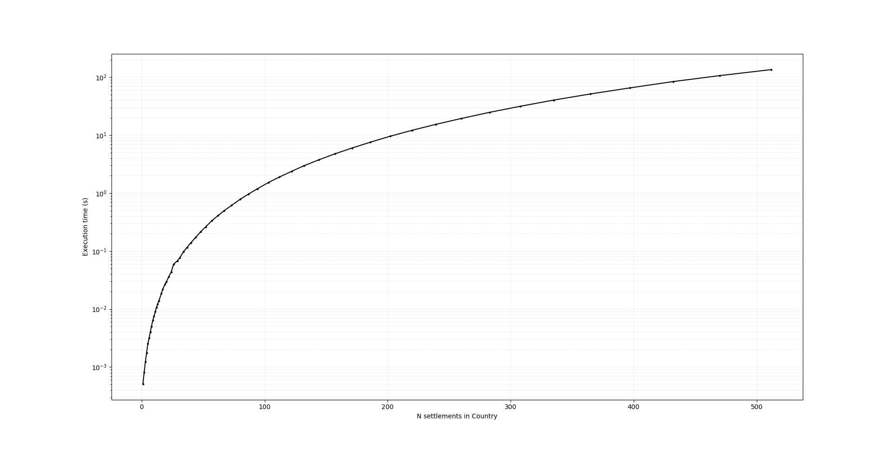

<!-- This is a comment block in Markdown. When the document is rendered, you won't see this text.

If you need help on MarkDown syntax, you can look at the guide here: https://www.markdownguide.org/basic-syntax/.
You are also welcome to ask the Module instructors for help with writing MarkDown.

You can use this template as the starting point for your report.
Answer the questions by writing your answers in the space between the bullet points.
If you are editing this file in VSCode, you can press CTRL+K then V to open a preview of the document.

Comment blocks end by closing the "arrow" we opened at the start. -->

# Determining Depot Locations: Report

<!-- This module is anonymously marked - please DO NOT include your name! -->
Candidate Number:

<!-- The headers that follow correspond to all questions in the assignment that require a written answer. 

You can write as much as you like for your answers in the space provided.
However please bear in mind that a good answer and a long answer are not necessarily the same thing! -->

## `Location` equality

1. Why might the definition of "equal" not be desirable, if we did not have the assurance from CLtd at the start of this task?

If names and regions are not uniquely defined, there may be distinct locations with the same name and region that are treated as the same location.
This could lead to issues in route planning where distinct locations are skipped because they're treated as equal to locations that have already been visited.

2. Are there any problems you foresee with this definition of "equal", even with the assurance (at the start of this task) from CLtd?

There may be instances where you would want to divide and differentiate a location based on an attribute.
For instance, if a location receives and delivers goods it could be treated as both a settlement and depot.
The current assurance does not permit two location entries describing the same location but separate depot status.

3. Suggest an idea for avoiding / resolving the problem you raised in point 2, if you identified any. Choose one of your choice if you identified multiple issues. **Do not** implement this idea in your code, however.

A solution could be to assign each location a unique identifier. Locations will only be treated as equal if their identifiers match. 
This would allow two location entries with the same name and region, but different depot status to co-exist and still be treated as unique for the 
purposes of route planning.

## Fastest Trip From a Given `Location`

1. Is it possible, even after the tie-breakers given in the assignment task, for there to still be multiple entries in `potential_locations` to choose as the closest? (Yes/ No)

No 

2. If not, why not? If so, what are the circumstances under which this could happen?

The tied entries are sorted alphabetically using the sorted function and the entry which comes first alphabetically is selected. 
There can't be multiple entries unless both the names and regions of the locations are identical, which can't happen given our dataset.

3. How can you edit the method to fix the problem (if there is one) without forcing an error to be thrown? (Do not forget, you should implement these fixes in your code if you identify any here).

## Execution Time for the NNA

1. Identify (at least) one aspect of the `regular_n_gon` that makes it difficult to understand, or that might make it difficult to understand in the future. Suggest how this might be addressed.

The docstring clearly explains the purpose of the function, but it might be worth briefly annotating what each section of the function itself is doing.
This can make it easier to troubleshoot if the function isn't working as intended.

If the function isn't being implemented correctly, adding error warnings could help the user troubleshoot.

2. Assess the advantages and disadvantages of using `Country`s like those generated from `regular_n_gon` for gathering the execution times $t_{\text{exe}}$, as opposed to a `Country` like the one in `locations.csv` or a `Country` with randomly-distributed settlements. You should give at least one advantage or one disadvantage.

Advantages:
- Regularly spaced settlements which increase in regular patterns should increase performance times by optimizing time and distance calculations. This means gathering the execution time data shouldn't take an absurd length of time for a reasonable range of settlements.

- Countries produced using regular_n_gon are produced in a standardized manner, meaning you can isolate how settlement number affects execution time. For example,       settlements being located in other regions, and the number of settlements in the destination region would affect calculations of the best route and impact execution time. These variables are removed when using regular_n_gon countries.

- Testing execution time using standardized Countries should make it easier to compare results across different runs and identify trends.

Disadvantages:
- The primary disadvantage is the reduction of real-world relevance. For example, travel to different regions would be a common scenario in real world situations, but this variable is removed when using regular_n_gon.

- It may be more difficult to identify performance bottlenecks or edge cases when the Countries don't simulate the real situation as accurately. 

3. Comment on the relationship between the execution time $t_{\text{exe}}$ and number of settlements $N_{\text{locs}}$, given the data in your plot. You should include your plot as an image here.

Execution time does not appear to increase exponentially with number of settlements, but there is some form of polynomial relationship.

4. Why do you think $t_{\text{exe}}$ and $N_{\text{locs}}$ have this kind of relationship?

As N_locs increases, the number of settlements that the NNA has to search through increases quadratically. For example, if there are N settlements the algorithm computes the fastest time between N settlements and moves to the closest one. On the next iteration it computes the fastest time between N-1 settlements etc. The total number of computations is (n + (n-1) + (n-2) + (n-3) + ...) which sums to (n(n-1)/2). Ignoring the constants and lower order term the number of computations increases with n^2 hence the execution time should increase with n^2. However, this isn't the only factor influencing execution time. The best_depot method is also called which computes the NNA for a number of different depots, which may result in a linear increase in execution time as N increases. Hence the total relationship should be described by some polynomial with dominant quadratic and linear terms.